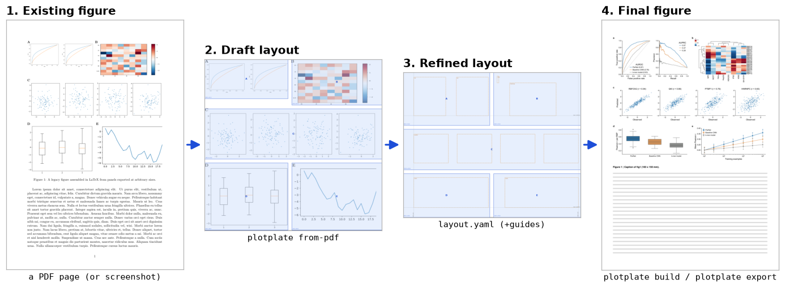

# plotplate

Build multi-panel figures from independent matplotlib panels that fit a layout exactly.



## Why

Panels exported from notebooks at "readable" sizes get rescaled or cropped when assembled in LaTeX,
Illustrator or Inkscape.
Each panel then prints with different font sizes and line widths.

This tool reverses the order:

1. You describe the figure once, in a `layout.yaml`: the sheet it is printed on, the figure's own
   size, panel boxes, alignment guides, journal rules.
1. Each panel is drawn by its own notebook, at exactly the size of its box.
1. The panels are assembled at scale 1.0, so every font prints at its true size, and the checks can
   prove it.

## Install

Three independent steps; do the ones you need.

### 1. The `plotplate` command, once per user

Use it to build layouts from PDFs, draw wireframes, preview and export, in any folder:

```sh
# pixi (a global environment you can extend with conda packages)
pixi global install --git https://github.com/<org>/plotplate.git plotplate

# or pipx
pipx install "plotplate @ git+https://github.com/<org>/plotplate"

# or uv
uv tool install "plotplate @ git+https://github.com/<org>/plotplate"
```

All three work the same on Linux and macOS, and nothing is cloned into your projects.
The tool needs nothing beyond its own dependencies (matplotlib, numpy, pyyaml, pymupdf).

### 2. The library, in the environment that draws your figures

Panel notebooks `import plotplate`, so the library must be installed where they run.
This is the step that matters for producing figures; step 1 is a convenience.

```sh
cd my-project
pixi init                       # only if the project has no pixi.toml yet
pixi add "python>=3.12"
pixi add --pypi plotplate \
    --git https://github.com/<org>/plotplate.git --branch main   # or --tag vX.Y.Z
pixi run plotplate --help       # the command is available here too
```

which writes:

```toml
[pypi-dependencies]
plotplate = { git = "https://github.com/<org>/plotplate.git", branch = "main" }
```

Run the commands through that environment (`pixi run plotplate build figures/figure_1`):
`plotplate build` executes your panel notebooks with the project's Python, where pandas, seaborn and
the rest already live.
`pip install` works the same way in a non-pixi project.

### Which installation runs what

| commands | what they need | where to run them |
| --- | --- | --- |
| everything except `build` (layouts, wireframes, previews, exports, diffs, checks) | plotplate only | either installation |
| `plotplate build`, `plotplate demo --build` | they execute *your* panel notebooks | the project environment, because the notebooks import plotplate and your own packages |

So: use the user-wide command for layout work anywhere, and run builds through the project
(`pixi run plotplate build …`).

Two installations can disagree, and the tools say so instead of letting it pass:

```sh
plotplate doctor              # both versions, both paths, fonts, optional packages
plotplate doctor --python .pixi/envs/default/bin/python
```

`plotplate build` refuses to run when the interpreter cannot import plotplate, and warns when its
version differs from the command's.
`--python /path/to/python` picks the interpreter that runs the notebooks, so one command can drive
another environment on purpose.
Pin the same tag in both installations to keep them equal.

### 3. The agent skills (optional)

```sh
plotplate skills --dest .claude/skills     # Claude Code, this project
plotplate skills --dest ~/.claude/skills   # Claude Code, every project
plotplate skills --list                    # what each one is for, and where it is
plotplate skills --paths                   # just the paths: hand them to an agent to read
plotplate skills --json                    # the same, for a script
plotplate skills --print                   # any other agent: paste, or append to AGENTS.md
```

The skills travel inside the package, so they are there however plotplate was installed — from PyPI,
from a git URL, or as an editable checkout — and `--paths` always prints files that can be opened.

### Fonts

Install Arial (on Debian/Ubuntu: `ttf-mscorefonts-installer`), then run `plotplate fonts --rebuild`
once.

## Try the demo

```sh
plotplate demo figure --dir ~/plotplate-demo --build   # the whole walkthrough
plotplate view ~/plotplate-demo/figures/figure_1       # then look at what it made
```

The case ships inside the package, so it runs from anywhere.
It starts from a manuscript page where a figure was assembled by hand, reads it back, optimizes the
space it wasted, draws the panels of the maintained layout, and exports the result — so the folder
ends up with three layouts of one figure to compare.
It draws panels, so it needs pandas, pyarrow, scipy and seaborn in the environment that runs it: run
it from a project environment that has them, add them to the tool
(`pixi global add --environment plotplate …`, `pipx inject plotplate …`), or pass `--python`.
[The demo README](src/plotplate/demo/figure/README.md) walks through every step.

## Where files go

`plotplate` works on the folder you point it at.
Every output is written next to the `layout.yaml` you pass, never inside the installation:

```text
any/folder/figure_1/
  layout.yaml            # you write it (step 1)
  layout.optimized.yaml  # optional alternatives: layout.<variant>.yaml
  panel_A_*.py           # your panel notebooks (step 2)
  data/                  # optional: the tables your notebooks read
  panels/A.pdf ...       # written by panel.save()
  preview.pdf/png        # written by plotplate build / plotplate preview
  figure_1.tex           # written by plotplate build / plotplate latex
```

Commands take either the file or the folder (`plotplate build figures/figure_1`), and `plotplate view`
offers every `layout.<variant>.yaml` it finds next to `layout.yaml`.

There is no project skeleton to copy.
Keep figures inside an existing analysis or paper repository, one folder per figure.

## Step 1: get a layout

The layout is the starting point of everything else.
Pick the source you have:

| you have | command | notes |
| --- | --- | --- |
| a PDF of an assembled figure (Overleaf, Illustrator, Inkscape export) | `plotplate from-pdf page.pdf -o figure_1/layout.detected.yaml --journal nature --width double --axes --guides --wireframe check.png` | exact panel positions, panels named from their letters, and with `--axes --guides` the plotting areas and the edges panels share |
| a screenshot | `plotplate detect shot.png --width 183 -o figure_1/layout.detected.yaml --wireframe check.png` | image-based; then `plotplate merge` and `plotplate tidy` |
| a drawing (Inkscape, Illustrator) | `plotplate svg-import drawing.svg -o figure_1/layout.yaml` | one rectangle per panel, in a layer named `panels` |
| nothing yet | `plotplate new figure_1/layout.yaml --journal nature --width double --height 150 --mosaic "AB/CC/DE"` | a grid to adjust |

Always look at the result:
`plotplate wireframe figure_1/layout.yaml` draws the boxes (optionally over the source with `--background`), and `plotplate view figure_1`
shows it on the page.
A layout read back from an old figure keeps that figure's white space;
`plotplate optimize figure_1/layout.detected.yaml --gap 4` gives it back to the panels, within a distortion limit you set, and writes `layout.optimized.yaml` next to it ([docs/optimize.md](docs/optimize.md)).
To adjust boxes by hand, `plotplate svg-export figure_1/layout.yaml`, move the rectangles in Inkscape,
then `plotplate svg-import`.
[docs/layout-sources.md](docs/layout-sources.md) explains what each source must contain;
[docs/layout-spec.md](docs/layout-spec.md) documents the file.

No language model is needed for any of these commands: the PDF reader follows the page's drawing
instructions, and image detection splits along blank gutters.
An agent can drive them, and decide the parts that are judgement (grouping, naming, which edges should
align).

## Step 2: draw each panel

```python
import plotplate as pp

panel = pp.Layout.load("layout.yaml").panel("A")
fig = panel.figure()  # exact size of box A, style applied
ax = panel.axes(fig, "roc")  # plotting area from the layout, aligned with other panels
ax.plot(fpr, tpr)
panel.save(fig)  # panels/A.pdf, .svg, .png + checks (font sizes, clipping, overlaps…)
```

Seaborn clustermaps, Marsilea heatmaps, gridspecs and panels combining several of them are supported.
[docs/panel-recipes.md](docs/panel-recipes.md) shows how, and lists what not to do
(`tight_layout`, `bbox_inches="tight"`, moving axes by hand).

## Step 3: assemble and deliver

```sh
plotplate view figure_1                                # look at it: page, boxes, axes, guides, checks, live
plotplate build figure_1                               # run all panel notebooks, preview, LaTeX snippet, checks
plotplate align figure_1                               # do the panels line up? (millimetres, not eyeballing)
plotplate preview figure_1 --page a4 --rules           # the figure on a page, with the alignment lines drawn
plotplate bundle figure_1 build/overleaf/figure_1      # .tex + panel PDFs to upload to Overleaf
plotplate export figure_1 -o Figure1.pdf               # single production file (.pdf or .tif)
```

Every command writes files and prints text; none of them opens a window, so they work the same over
SSH or in CI.
`plotplate preview` writes `preview.pdf`, `preview.png` and `preview.svg` next to the layout, and
`--page a4` adds `preview-page.pdf/png`.
Open them with your own viewer, or read the PNG with an agent.

The preview has no margins on purpose: it is the figure file itself.
Page margins and captions belong to the manuscript; `--page a4` shows the figure in that context.

## Documentation

- [docs/workflow.md](docs/workflow.md): the complete workflow, with every option.
- [docs/layout-sources.md](docs/layout-sources.md): what a PDF, screenshot or drawing must contain.
- [docs/panel-recipes.md](docs/panel-recipes.md): panel code recipes, dos and don'ts, complex
  compositions.
- [docs/alignment.md](docs/alignment.md): guides, measured geometry, alignment rules.
- Revising a figure later: [workflow.md](docs/workflow.md#changing-the-layout-later) and the
  `figure-layout-revision` skill.
- [docs/coordinates.md](docs/coordinates.md): page, area, panel, axes, guides and gutters — one
  picture of every term, and the conversions between the coordinate systems.
- [docs/layout-spec.md](docs/layout-spec.md): the `layout.yaml` reference.
- [docs/constraints.md](docs/constraints.md): panel boxes solved from relations instead of typed
  numbers.
- [docs/optimize.md](docs/optimize.md): spending the white space of a drafted layout, and the
  distortion limit that decides how far it may go.
- [docs/journal-specs.md](docs/journal-specs.md): figure requirements of Nature, Science, Cell, NAR,
  Genome Biology, Genome Research and PLOS, with sources.
- [docs/related-tools.md](docs/related-tools.md): every tool considered — styling, composition, figure
  segmentation, plot digitisation — what is used here and why the rest is not.
- [docs/design-notes.md](docs/design-notes.md): decisions, limitations, open questions.

## Commands

| command | purpose |
| --- | --- |
| `plotplate demo` | copy (and `--build`) the complete example |
| `plotplate from-pdf` / `plotplate detect` / `plotplate svg-import` / `plotplate new` | create a layout |
| `plotplate merge` / `plotplate tidy` / `plotplate svg-export` / `plotplate resolve` / `plotplate relabel` | adjust a layout |
| `plotplate optimize` | give the white space between panels back to the panels, within a distortion limit |
| `plotplate diff` | compare two layouts: moved, merged, split, added, removed, with a revision plan |
| `plotplate validate` / `plotplate wireframe` / `plotplate align` / `plotplate features` | inspect a layout, check alignment, list measurable features |
| `plotplate view` | local page showing the figure on its sheet, with the layout and every variant on top (`--edit` to drag the boxes and save a variant) |
| `plotplate build` | run panel notebooks, then preview, LaTeX and checks |
| `plotplate preview` / `plotplate latex` / `plotplate check` | individual build steps |
| `plotplate bundle` / `plotplate export` | deliver to Overleaf or to a journal |
| `plotplate journals` / `plotplate palettes` / `plotplate fonts` / `plotplate skills` | presets, colours, fonts, agent skills |
| `plotplate features --check` | list panel parts; fail when any axes is unnamed |
| `plotplate doctor` | which versions and environments are in play |

## Contributing

Development uses Pixi; see [CONTRIBUTING.md](CONTRIBUTING.md).
