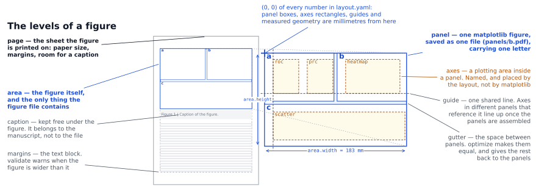

# Coordinate systems

[← README](../README.md) · [layout reference](layout-spec.md) · [alignment](alignment.md)

## Scope

This file names the levels a figure is built from, and gives the conversions between their coordinate
systems.



Everything below is that picture in words.

## The levels

| level | what it is | who defines it |
| --- | --- | --- |
| **page** | the physical sheet: paper size, margins, room for the caption | optional `page:` section |
| **area** | the figure's own box, the thing the manuscript calls "Figure 1" | `area: {width, height}` |
| **panel** | one matplotlib `Figure`, saved as one file, carrying one letter | `panels:` entries |
| **axes** | a plotting area inside a panel | `axes:` entries, or named in the panel code |

A panel *is* a matplotlib figure: `savefig` writes exactly one panel.
A `SubFigure` cannot be saved on its own, and libraries such as seaborn's clustermap always create
their own figure, which is why "one panel = one figure = one file" is the rule here, and why there is
no level between panel and axes.

## Where these words come from

Most of them are borrowed, so that a layout file can be read by someone who has never seen plotplate.
One is ours, and a few are borrowed words that mean something slightly different elsewhere.

| this project | matplotlib | LaTeX | Illustrator / Inkscape | journal guidelines |
| --- | --- | --- | --- | --- |
| page | - | the page (`\paperwidth`) | document, page | page size |
| margins | - | the body, `geometry` margins | margins | margins |
| **area** | `Figure` | the `\includegraphics` box | artboard, canvas | "the figure" |
| panel | `Figure` (one per file) | a `subfigure` | an object group | **panel** (`a`, `b`, `c`...) |
| axes | **`Axes`** | - | - | a plot, a chart |
| axis guide | - | - | - | - |
| page guide | - | - | **guide** (a non-printing line) | - |
| gutter | `wspace`, `hspace` | `\columnsep` | gutter (between columns) | space between panels |
| caption | - | `\caption` | - | caption, or **legend** |

- **area** is the only word invented here.
  The candidates were taken: "figure" is what matplotlib calls a panel *and* what the manuscript calls
  the whole thing, "page" is the sheet, and "artboard" belongs to a drawing program.
  So the figure's own box is the *area*.
- **axes**, in matplotlib and here, is one whole plot, not the two lines through the origin.
  This trips up everyone once; matplotlib's own documentation says as much.
- **gutter** in bookbinding is the inner margin of a page; here it is only the space between two
  panels, as in a column layout.
- a **page guide** is the drawing program's guide: a line you put on the sheet to arrange things
  against.
  An **axis guide** is the other thing plotplate calls a guide, and it is a reference: an axes can be
  *placed at* it ([alignment.md](alignment.md#three-kinds-of-line-and-when-they-disagree)).
- **caption** is LaTeX's word; most life-science journals say *legend* for the same text. plotplate
  never typesets it, it only keeps room for it (`page.caption`).

## The systems

| system | unit | origin | used by |
| --- | --- | --- | --- |
| sheet | mm | top-left of the paper | the page view, caption fit |
| **layout** | mm | top-left of the **area** | everything in `layout.yaml`, `geometry` in panel files, `alignment.yaml` |
| figure fraction | 0-1 | bottom-left of the panel | matplotlib (`add_axes`, `get_position`) |
| data | your units | your axes | your plotting code |

Layout millimetres are the common currency: panel boxes, axes rectangles, guides, measured geometry
and alignment rules all live there, which is what lets panels drawn by different scripts be compared.

## Conversions

```python
panel.rect(x, y, w, h)  # layout mm  -> figure fraction (for add_axes, gridspec)
panel.page_point(ax, x, y)  # data       -> layout mm
panel.axes_rect("roc")  # the layout rectangle of a named axes, in layout mm
panel.mark("zero", ax=ax, x=0, y=0)  # remember a data point, stored in layout mm
panel.anchor("key", artist)  # remember an artist's box, stored in layout mm
```

Measured geometry (`panels/<panel>.json`) is always in layout millimetres, so `plotplate features` and
`plotplate align` compare panels directly.

Sheet coordinates come in only when a `page:` section exists: the area is centred horizontally in the
text block, and `plotplate preview --page a4` draws it there.

## Example

```yaml
page: {paper: a4, margins: {top: 25, bottom: 25, left: 20, right: 20}, caption: 25}
area: {width: double, height: 150}      # 183 mm from the journal preset
panels:
  A:
    box: [0, 0, 89.5, 55]               # layout mm, origin at the area's top-left
    axes:
      roc: {left: 11, top: 5, right: 44, bottom: 45}
```

`plotplate validate` then reports when the area is wider than the text block, or when its height plus
the caption allowance would push the caption onto the next page.

## Older layouts

Layouts that use `page: {width, height}` for the figure box keep working: when there is no `area:`
section, `page:` is read as the box, exactly as before.
